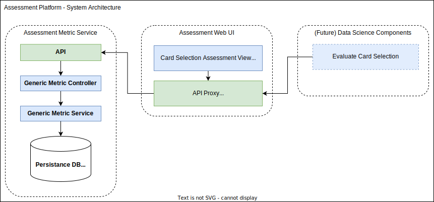

<a id="readme-top"></a>

<!-- PROJECT LOGO -->
<br />
<div align="center">
  <a href="https://github.com/othneildrew/Best-README-Template">
    
  </a>

<h3 align="center">Assessment Platform Example PoC</h3>

  <p align="center">
    An proof of concept for an assessment platform with an example card selection game.
    <br />
</div>


<!-- TABLE OF CONTENTS -->
<details>
  <summary>Table of Contents</summary>
  <ol>
    <li>
      <a href="#getting-started">Getting Started</a>
      <ul>
        <li><a href="#prerequisites">Prerequisites</a></li>
        <li><a href="#installation">Installation</a></li>
        <li><a href="#deinstallation">Deinstallation</a></li>
      </ul>
    </li>
    <li><a href="#rough-architecture-overview">Rough Architecture Overview</a>
     <ul>
       <li><a href="#system-architecture-overview">System Architecture Overview</a></li>
       <li><a href="#card-selection-assessment-game">Card Selection Assessment Game</a></li>
     </ul>
</li>
    <li><a href="#roadmap">Roadmap</a></li>
  </ol>
</details>


<!-- GETTING STARTED -->

## Getting Started

### Prerequisites

To run deploy this application you need to have `docker` and `docker-compose` installed. For installation details see
the [docker documentation](https://docs.docker.com/compose/install/).

### Installation

Deploy the service to the docker environment:

   ```sh
docker compose up --build --detach

   ```

After running the command above, you're able to

* access the web UI in your browser via http://localhost:3000/CardSelection.
* download the data for analysis via `http://localhost:3000/CardSelection/Data/<code>`.

### Deinstallation

Stop and remove the containers from your docker environment (without clearing the database):

   ```sh
   docker compose down
   ```

If you need to also clear the database run:

   ```sh
   docker compose down --volumes
   ```

<p align="right">(<a href="#readme-top">back to top</a>)</p>

## Rough Architecture Overview

### System Architecture Overview

The system consists of the following components:
* Assessment Web UI (TypeScript, React)
* Assessment Metric Service (TypeScript, NestJS, MongoDB)

Each component is containerized and can be deployed with `docker-compose`.




<p align="right">(<a href="#readme-top">back to top</a>)</p>

### Card Selection Assessment Game


> __Note:__ The class `CardSelectionAssessmentMetric` could be simplified to `AssessmentMetric`. Also we could think about a stricter encapsulation. 

<!-- ROADMAP -->

## Roadmap

- [x] Add an __assessment metric service__ to persist assessment metrics
    - [x] Service logic
    - [x] Connect to database
    - [x] Containerize the service
- [x] Add a __Web UI__ with a __card selection assessment__ (game)
    - [x] Game logic
    - [x] UI components and design
    - [x] Containerize the UI
- [x] Add back to top links
- [ ] Discuss this first approach with the team
- [ ] Adjust the roadmap based on the team's feedback

### Ideas for Future Development

* Requirement Clarifications
    - [ ] On the mockup screens there are cards with only a number and without letters. In the requirements is
      written `Each card is labelled with exactly one number (1-9), and between one and four letters, the order is random.`.
      I've sticked to the requirements. Is this correct?
* Features
    - [ ] Add Multi-language Support
    - [ ] Consider adding the information if the correct card was selected. This would simplify data analysis for the
      python script.
    - [ ] Add a user authentication mechanism
    - [ ] Username validation e.g. prevention of forbidden characters '/'
    - [ ] Implement proper logging and error handling
    - [ ] Add automated tests (e.g. unit tests, integration tests, e2e tests)
    - [ ] Add MonoRepo tools like `nx` or `lerna`
* Refactorings & Code Improvements
    - [ ] Remove all `TODO` comments
    - [ ] Remove `any` where possible
    - [ ] Rethink namings especially in the `assessment metric service`

<p align="right">(<a href="#readme-top">back to top</a>)</p>
